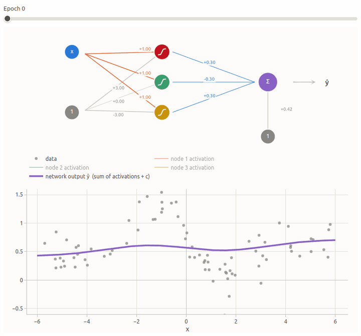

# Neural nets from scratch

Interactive notes that build neural networks from the ground up, starting from linear regression. Everything runs in the browser: drag the sliders, press train, and watch gradient descent fit the data.

**Read the notes here: https://acycliq.github.io/neural_nets_from_scratch/**

The demo above is from Chapter 2: a network with three sigmoid hidden nodes learns a non-linear function from noisy data by gradient descent.

## Chapters

1. [Linear regression as a neural network](https://acycliq.github.io/neural_nets_from_scratch/): recap linear regression with sliders, draw the same model as a network diagram, then add a hidden layer and build a new function out of two lego blocks (ReLU or sigmoid).
2. [Non-linear regression with gradient descent](https://acycliq.github.io/neural_nets_from_scratch/chapter2.html): three sigmoid blocks fit a non-linear function, with a train button, an epoch replay slider, and a noise slider.
3. [A second hidden layer](https://acycliq.github.io/neural_nets_from_scratch/chapter3.html): when one hidden layer cannot fit the shape, go wider or go deeper, and count the parameters either way.
4. [Classification with softmax](https://acycliq.github.io/neural_nets_from_scratch/chapter4.html): three classes, softmax, cross-entropy, and two plots that learn together: a decision-region map and a probability triangle.
5. [Generalization](https://acycliq.github.io/neural_nets_from_scratch/chapter5.html): hold points back, watch a big network win on the training data and lose on the test data, then overfit by hand and pay for it.
6. [The training toolkit](https://acycliq.github.io/neural_nets_from_scratch/chapter6.html): learning rates, momentum, minibatches and Adam, raced against each other on chapter 2's network.

